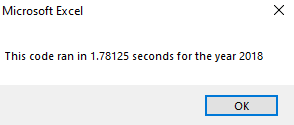

# VBA_Challenge
## Project Overview
The purpose of this challenge was to provide the client with the analyis of two years' of data for any number of stocks at the touch of a button.  We were also tasked with evaluating using arrays as an alternative method to establish our variables and determine how efficient the code would be.
## Stock Results and Code Efficiency
The results of the 2-year portfolio analysis were as follows:

 
 

Regarding stock performance, the client will find that 2017 was clearly a more bullish year than 2018.
Regarding the performance of the code, when the variables were coded as arrays for output data, the code consistently ran faster.  

As sample comparison shows as follows:

 

Running the code multiple times showed that the refactored code ran about 0.1 seconds faster.  We can assume that for a larger group of stocks, this efficiency would increase.  While introducing arrays to the refactored code introduced some complexity in the coding itself, once developed, the code was much more elegant and compact, and seemingly uses less computer power to execute.
